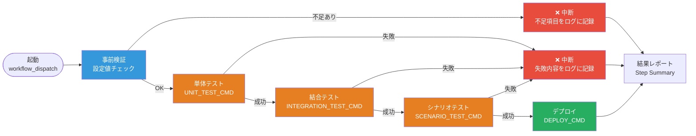

# デプロイ手順書（Deploy Guide）

GitHub Actions によるデプロイパイプラインのセットアップと運用の手順書。
本手順書は Phase 7（MVP構築）ゲート条件「デプロイパイプラインの構成」の一部として管理し、
デプロイ構成を変更した際は必ず本書を更新すること。

**関連ファイル:**

| ファイル | 役割 |
|---------|------|
| `.github/workflows/deploy.yml` | デプロイパイプライン本体（GitHub Actions） |
| `scripts/setup-deploy-secrets.ps1` | 設定値登録スクリプト（PowerShell） |
| `scripts/run-test-stage.sh` | テスト・デプロイ各ステージの共通実行ラッパー |
| `.ai-native/guides/ci-cd-setup.md` | デプロイ以外のCI/CD（ラベル・PRチェック等）のセットアップ |

---

## §1 パイプラインの全体像

デプロイは必ず自動テスト（単体・結合・シナリオ）のゲートを通過してから実行される。
**いずれかのテストが失敗した場合、デプロイは中断され、失敗内容がログに記録される。**



**設計原則:**

- **テストゲート必須:** テストを通過しないデプロイ経路は存在しない（ワークフローの `needs` 依存関係で構造的に強制）
- **設定値は repository secrets / variables から読み取る:** 認証情報・接続情報をコードやコミットに含めない
- **失敗の追跡可能性:** 何がどのように失敗したかを Step Summary・アーティファクト・エラーアノテーションの3か所に記録する
- **同時デプロイ禁止:** 同一環境への並行デプロイは `concurrency` 設定で直列化される

---

## §2 前提条件

| 項目 | 要件 |
|------|------|
| PowerShell | 7.1 以降（Windows PowerShell 5.1 は非対応。https://aka.ms/powershell から入手） |
| GitHub CLI | `gh` インストール済み・認証済み（`gh auth login`） |
| リポジトリ権限 | secrets / variables の登録に管理者（admin）権限が必要 |
| テストコード | プロジェクト側に単体・結合・シナリオテストが実装されていること |

GitHub CLI の認証確認:

```powershell
gh auth status
```

---

## §3 設定値の一覧

### repository variables（非機密: 実行コマンド）

| 変数名 | 必須 | 内容 | 設定例 |
|--------|------|------|--------|
| `SETUP_CMD` | 任意 | 依存関係インストール等のセットアップ | `npm ci` |
| `UNIT_TEST_CMD` | 必須 | 単体テストの実行コマンド | `npm run test:unit` |
| `INTEGRATION_TEST_CMD` | 必須 | 結合テストの実行コマンド | `npm run test:integration` |
| `SCENARIO_TEST_CMD` | 必須 | シナリオテスト（E2E）の実行コマンド | `npm run test:e2e` |
| `DEPLOY_CMD` | 必須 | デプロイの実行コマンド | `npx firebase deploy --token "$DEPLOY_TOKEN"` |

### repository secrets（機密: 認証情報）

| シークレット名 | 必須 | 内容 |
|--------------|------|------|
| `DEPLOY_TOKEN` | 必須 | デプロイ先の認証トークン（Firebase CI トークン、クラウドAPIキー等） |
| `DEPLOY_TARGET` | 任意 | デプロイ先URL・ホスト名等（機密扱いにしたい場合） |
| （プロジェクト固有） | 任意 | 追加が必要な場合は §7 の拡張手順を参照 |

> **原則:** 機密値（トークン・パスワード・接続文字列）は必ず secrets へ。
> コマンド文字列など非機密の設定は variables へ。**いかなる値もコードにハードコードしない。**

### Cryptia アプリ（本リポジトリ）の実際の設定値

Cryptia アプリ（`app/` 配下、Firebase + GCP + Vertex AI 構成）では以下を使用する。
登録は §4 の Cryptia 専用スクリプトで一括実行できる。

| 種別 | 名前 | 値 / 内容 |
|------|------|-----------|
| variable | `SETUP_CMD` | `bash scripts/ci-setup.sh`（pnpm 導入 + 依存インストール） |
| variable | `UNIT_TEST_CMD` | `cd app && pnpm run test:unit` |
| variable | `INTEGRATION_TEST_CMD` | `cd app && pnpm run test:integration` |
| variable | `SCENARIO_TEST_CMD` | `cd app && pnpm run test:scenario` |
| variable | `DEPLOY_CMD` | `bash scripts/deploy-firebase.sh`（ビルド + Hosting/Functions/Rules デプロイ) |
| variable | `NUXT_VERTEX_LOCATION` / `NUXT_VERTEX_MODEL` | Vertex AI のリージョン・モデル名 |
| variable | `NUXT_TRUSTED_PROXY_HOPS` | 任意。AI API レートリミットが X-Forwarded-For の右端から数えるホップ数（既定 1。Hosting CDN 経由の構成で実クライアント IP がずれる場合に 2 を設定） |

> **ホップ数の検証（初回デプロイ後に必ず実施）:** Cloud Logging で Functions への
> リクエストの `X-Forwarded-For` を確認し、実クライアント IP が右端から何番目かを実測して
> `NUXT_TRUSTED_PROXY_HOPS` を確定する。値が実トポロジのインフラホップ数より大きいと
> 左端（偽装可能領域）へずれ、右端が共有プロキシ IP のままだと全ユーザーが単一の
> レートリミットバケットを共有して AI 機能が 429 で劣化する（フォールバック分析へ自動降格）。
| variable | `NUXT_PUBLIC_FIREBASE_API_KEY` ほか `NUXT_PUBLIC_FIREBASE_*` | Firebase Web 設定（公開可能な識別子） |
| variable | `NUXT_PUBLIC_FIREBASE_DATABASE_ID` | Firestore の名前付きデータベース ID（既定 `cryptia`。共有プロジェクト同居のための専用 DB） |
| variable | `FIREBASE_HOSTING_SITE` | 任意。デプロイ先 Hosting サイト名（共有プロジェクトでは専用サイトを指定。未設定時は既定サイト） |
| variable | `DEPLOY_FIRESTORE_RULES` | 任意。`true` で firestore.rules をパイプラインからデプロイ（専用 DB のみに適用されるため共有プロジェクトでも安全。要: DB 作成済み） |
| variable | `NUXT_AI_REQUIRE_AUTH` | 任意。`true` で AI API を認証必須化（未認証は 401。既定は匿名許可 + 低レート枠 20/分、認証済みは 40/分） |
| secret | `DEPLOY_TOKEN` | Firebase/GCP **サービスアカウント JSON キーの全文** |
| secret | `DEPLOY_TARGET` | Firebase プロジェクト ID |

#### 共有プロジェクトでの同居（他アプリと同一の Firebase/GCP プロジェクトを使う場合）

Cryptia は名前衝突を避けるため、リソース名にアプリ名 prefix を付与している:

| リソース | 名称 | 分離の仕組み |
|---------|------|-------------|
| Cloud Functions | 関数名 `cryptiaserver` / codebase `cryptia` | codebase 限定デプロイのため他アプリの関数に触れない（削除もしない） |
| Hosting | target `cryptia` → `FIREBASE_HOSTING_SITE` のサイトへ | サイト単位で分離 |
| Firestore | **専用の名前付きデータベース `cryptia`** + コレクション `cryptia-users` | ルール・データともデータベース単位で完全分離 |
| Service Worker キャッシュ / localStorage | `cryptia-` / `cryptia:` prefix | オリジン内でも衝突しない |

初回のみ、以下を作成する（PowerShell 5.1 / コマンドベースで完結）:

```powershell
# 1. Hosting 専用サイト（例: cryptia-app。URL は https://cryptia-app.web.app）
npx firebase-tools@14.27.0 hosting:sites:create cryptia-app --project <プロジェクトID>

# 2. Firestore 専用データベース
npx firebase-tools@14.27.0 firestore:databases:create cryptia --location asia-northeast1 --project <プロジェクトID>

# 3. 設定値の登録（サイト名とルールデプロイ有効化を含める）
.\scripts\setup-cryptia-secrets.ps1 -ProjectId "<プロジェクトID>" `
    -ServiceAccountJsonPath "C:\keys\sa.json" `
    -HostingSite "cryptia-app" -DeployFirestoreRules "true"
```

> サービスアカウントには `roles/firebase.admin`・`roles/cloudfunctions.developer`・
> `roles/iam.serviceAccountUser` 相当の権限、および Vertex AI 利用時は
> Cloud Functions 実行 SA に `roles/aiplatform.user` を付与する。

---

## §4 セットアップ手順（PowerShell）

### Cryptia アプリの一括登録（Windows PowerShell 5.1 対応・推奨）

本リポジトリの Cryptia アプリは専用スクリプト `scripts/setup-cryptia-secrets.ps1` で
必要な設定値をすべて一括登録できる。**Windows PowerShell 5.1 で実行可能**（PowerShell 7 不要）で、
スクリプトは UTF-8 (BOM付き) のため Shift-JIS 既定の環境でも文字化けしない。

```powershell
cd <リポジトリのルート>
.\scripts\setup-cryptia-secrets.ps1 `
    -ProjectId "your-firebase-project-id" `
    -ServiceAccountJsonPath "C:\keys\service-account.json" `
    -FirebaseApiKey "AIza..." `
    -FirebaseAuthDomain "your-project.firebaseapp.com" `
    -FirebaseAppId "1:123456:web:abcdef"
# Firebase Web 設定（-FirebaseApiKey 以下）は任意。未設定時はアプリが
# Firestore 同期なしのローカル保存モードで動作する。
```

機密値（サービスアカウント JSON）はコマンドライン引数に値そのものを載せず、
一時ファイル + 標準入力経由で `gh` に渡されるため、プロセス一覧・履歴に残らない。

以下は汎用テンプレートの手順（他プロジェクト向け。PowerShell 7.1 以降が必要）。

### 方法A: 対話モード（推奨）

機密値を画面に表示せずに入力できる。

```powershell
cd <リポジトリのルート>
./scripts/setup-deploy-secrets.ps1 `
    -UnitTestCmd "npm run test:unit" `
    -IntegrationTestCmd "npm run test:integration" `
    -ScenarioTestCmd "npm run test:e2e" `
    -DeployCmd "npx firebase deploy --token `"`$DEPLOY_TOKEN`"" `
    -SetupCmd "npm ci"
# → DEPLOY_TOKEN / DEPLOY_TARGET は続けて非表示プロンプトで入力
```

### 方法B: ファイル一括モード

`deploy-secrets.env`（`.gitignore` 済み）に KEY=VALUE 形式で記述して一括登録する。

```powershell
# 1. 設定ファイルを作成（このファイルは絶対にコミットしない）
@"
UNIT_TEST_CMD=npm run test:unit
INTEGRATION_TEST_CMD=npm run test:integration
SCENARIO_TEST_CMD=npm run test:e2e
DEPLOY_CMD=npx firebase deploy --token "`$DEPLOY_TOKEN"
SETUP_CMD=npm ci
DEPLOY_TOKEN=<デプロイ先の認証トークン>
"@ | Set-Content deploy-secrets.env

# 2. 一括登録
./scripts/setup-deploy-secrets.ps1 -EnvFile ./deploy-secrets.env

# 3. 登録後は設定ファイルを削除する
Remove-Item deploy-secrets.env
```

### 方法C: gh コマンド直接実行（フォールバック）

スクリプトが使えない環境での代替手順。

```powershell
gh variable set UNIT_TEST_CMD --repo owner/repo --body "npm run test:unit"
gh variable set INTEGRATION_TEST_CMD --repo owner/repo --body "npm run test:integration"
gh variable set SCENARIO_TEST_CMD --repo owner/repo --body "npm run test:e2e"
gh variable set DEPLOY_CMD --repo owner/repo --body "npx firebase deploy --token `"`$DEPLOY_TOKEN`""

# 機密値は履歴に残さないため、対話プロンプト経由で渡す
Read-Host -Prompt "DEPLOY_TOKEN" -MaskInput | gh secret set DEPLOY_TOKEN --repo owner/repo
```

### 登録の確認

```powershell
gh secret list --repo owner/repo
gh variable list --repo owner/repo
```

> **冪等性:** 上記手順は何度実行しても安全。既存の設定値が上書きされるだけで、
> 実行履歴・ログ等の記録系データには影響しない。

---

## §5 デプロイの実行

1. GitHub リポジトリの **Actions** タブ → **デプロイパイプライン / Deploy Pipeline** を選択
2. **Run workflow** をクリックし、デプロイ先環境（`staging` / `production`）を選択して実行
3. 実行結果は Run の **Summary** に表示される（各ステージの成否と失敗詳細）

CLI から実行する場合:

```powershell
gh workflow run deploy.yml --repo owner/repo -f environment=staging
gh run watch --repo owner/repo   # 進行状況の監視
```

**push 時の自動デプロイを有効にする場合:** `.github/workflows/deploy.yml` の
`on:` セクションにあるコメントアウトされた `push:` トリガーを有効化する。

**環境保護（推奨）:** リポジトリの Settings → Environments で `production` 環境に
必須レビュアーを設定すると、本番デプロイ前にオペレーターの承認を挟める
（方法論のオペレーター最終判断・SP-1 と整合する運用）。Phase 7 ゲート条件 7-8 の
確認時に、この設定の有無も合わせて確認すること。

**同時実行の注意:** 同一環境への実行は `concurrency` 設定で直列化される。GitHub の仕様上、
**待機中**の実行は同一環境への新しい実行が起動されると自動キャンセルされる（実行中のものは
キャンセルされない）。連続して複数回起動した場合、中間の実行がキャンセル扱いになるのは正常動作。

---

## §6 テスト失敗・デプロイ失敗時の対処

パイプラインが失敗した場合、**デプロイは実行されない**。以下の順に確認する。

### 6-1. 何が失敗したかの確認

| 確認場所 | 内容 |
|---------|------|
| Run の **Summary** | 失敗ステージ名・終了コード・実行コマンド・ログ末尾50行 |
| アーティファクト `deploy-logs` | テストゲート（単体・結合・シナリオ）の完全な実行ログ（30日保持） |
| アーティファクト `deploy-execution-logs` | デプロイステージの完全な実行ログ（30日保持） |
| ジョブのエラーアノテーション | 失敗箇所への直接リンク |

### 6-2. 失敗パターン別の対処

| 失敗ステージ | 主な原因 | 対処 |
|-------------|---------|------|
| 事前検証 | 設定値の未登録 | Summary に不足項目が列挙される → §4 の手順で登録 |
| 単体テスト | 実装のバグ、テストの期待値ずれ | ログで失敗テストを特定し、Minimal スコープ（修正→二重ゲートレビュー→承認）で修正 |
| 結合テスト | モジュール間 I/F の不整合 | I/F設計（Phase 5 成果物）との整合を確認して修正 |
| シナリオテスト | ユースケースレベルの動作不良 | ユーザー・運用サポートのテストシナリオと突き合わせて修正 |
| デプロイ | 認証エラー、デプロイ先の問題 | `DEPLOY_TOKEN` の有効期限・権限を確認。トークン再発行時は §4 で再登録 |

> **原則:** テスト失敗を「スキップして再実行」で回避しない。テストゲートの無効化・
> 緩和はシステム監査官の安全ゲート対象であり、オペレーター承認なしに行わないこと。

### 6-3. 本番障害を伴う場合

サービス停止等の緊急時は方法論の EMERGENCY_PATH（`phase-definitions.md`）に従う。
緊急対応時もテストゲートは省略せず、修正 → パイプライン実行 → デプロイの経路を維持する。

---

## §7 プロジェクト固有のカスタマイズ

### シークレットの追加

1. `scripts/setup-deploy-secrets.ps1 -EnvFile` またはghコマンドで新しいシークレットを登録する
   （例: `FIREBASE_SERVICE_ACCOUNT`）
2. `.github/workflows/deploy.yml` の deploy ジョブにある拡張ポイント
   （「プロジェクト固有のシークレットはここに追加する」コメント箇所）に環境変数を追記する:

   ```yaml
   FIREBASE_SERVICE_ACCOUNT: ${{ secrets.FIREBASE_SERVICE_ACCOUNT }}
   ```

3. 同じ deploy ステップの `SCRUB_SECRET_NAMES` に追加したシークレット名を列挙する:

   ```yaml
   SCRUB_SECRET_NAMES: DEPLOY_TOKEN DEPLOY_TARGET FIREBASE_SERVICE_ACCOUNT
   ```

   > ここに列挙された環境変数の値は、ログ・Step Summary の保存前に `***` へ置換される。
   > 列挙漏れがあると、デプロイコマンドがその値を出力した場合にアーティファクトへ
   > 平文で残るため、シークレット追加時は必ずセットで更新すること（§9 参照）

4. 本手順書 §3 の一覧表に追加したシークレットを追記する（コードとドキュメントの一貫性）

### テストステージの調整

- テストコマンドの変更は repository variables の更新のみで完結する（ワークフロー変更不要）
- ステージ追加（例: 静的解析）が必要な場合は `test` ジョブにステップを追加し、
  `scripts/run-test-stage.sh` を再利用する

---

## §8 手動デプロイ（フォールバック）

GitHub Actions が利用できない場合のみ、以下の手順で手動デプロイする。
**手動デプロイは緊急フォールバックであり、通常経路にしないこと。**

1. ローカルで全テストを実行し、全通過を確認する（`&&` 連結により前段失敗時点で停止する）:

   ```powershell
   npm run test:unit && npm run test:integration && npm run test:e2e
   ```

2. すべて成功した場合のみ、デプロイコマンドを実行する（認証情報は環境変数で渡す）:

   ```powershell
   $env:DEPLOY_TOKEN = Read-Host -Prompt "DEPLOY_TOKEN" -MaskInput
   npx firebase deploy --token "$env:DEPLOY_TOKEN"   # プロジェクトの DEPLOY_CMD に読み替える
   ```

3. 手動デプロイした事実・理由・結果を意思決定ログ（progress-management.md）に記録する
4. 事後に GitHub Actions 経路を復旧し、次回以降は必ずパイプライン経由に戻す

---

## §9 セキュリティ上の注意

- **認証情報をコミットしない。** リポジトリ内での機密値の管理は repository secrets のみとする
  （`scripts/validate-docs.sh` の C-4 シークレット混入チェックが CI で検知する）
- **ログ・アーティファクトへの露出に注意。** GitHub のシークレットマスキングはストリームログ
  にのみ適用され、**アーティファクトファイルや Step Summary の内容には適用されない**。
  パイプラインは `SCRUB_SECRET_NAMES` に列挙されたシークレット値を保存前に `***` へ置換するが、
  デプロイコマンド側でも冗長出力（`curl -v`、デバッグモード等）でトークンを出力しない構成にすること。
  シークレット追加時は §7 の手順で `SCRUB_SECRET_NAMES` を必ず更新する
- **トークンは最小権限で発行する。** デプロイに必要な権限のみを持つトークンを使用する
- **漏えい時は即時ローテーション。** トークンがコミット履歴・ログ等に露出した場合は、
  直ちに発行元で無効化（revoke）→ 再発行 → §4 で再登録する。コミット削除だけでは不十分
  （履歴・フォーク・キャッシュに残るため、無効化が唯一の確実な対処）
- **定期ローテーション。** 認証トークンは有効期限を設定し、期限前に §4 の手順で更新する
