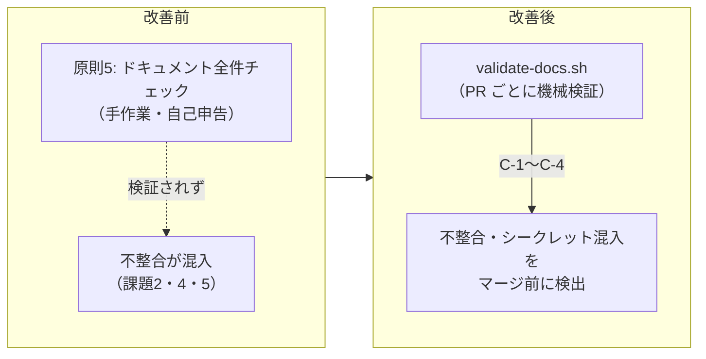

# 方法論評価レポート（2026-07-22: デプロイパイプライン統合とリポジトリ監査）

## 評価期間・対象

- **期間:** 2026-07-22
- **対象:** リポジトリ全体（方法論ドキュメント・ワークフロー・ガイド・設定ファイル）
- **実施ロール:** 方法論エデュケーター（主担当）、システム監査官・コードレビュアー（監査・レビュー視点で招集）
- **契機:** オペレーターからの改善依頼（GitHub Actions デプロイ＋テストゲート導入、現状監査）

---

## 検出された課題と対応状況

| # | 課題 | 重大度 | 根本原因 | 対応 |
|---|------|--------|---------|------|
| 1 | `.claude.json` に GitHub PAT（`ghp_****`）がハードコードされコミットされている | **CRITICAL** | シークレット混入を検知する仕組みが存在しなかった | **要オペレーター対応**（下記「未解決事項」参照）。再発防止として `scripts/validate-docs.sh` C-4（シークレット混入チェック）を PR チェックに追加 |
| 2 | `guides/ci-cd-setup.md` が2ドキュメント（usage-guide.md, github-integration.md）から参照されているが実在しない | 高 | ドキュメント参照の実在を検証する仕組みがなかった | `guides/ci-cd-setup.md` を作成。再発防止として validate-docs.sh C-3（ガイド参照実在チェック）を追加 |
| 3 | `sync-external-repo.yml` の `rsync --delete` が、同期元に存在しないリポジトリ固有ファイルを削除する（原則2「冪等性と状態保護」違反: 記録系データの巻き戻し） | 高 | 同期設計時にリポジトリ固有ファイルの存在が考慮されていなかった | `.github/sync-protect.txt`（保護リスト）を新設し、`--exclude-from` で保護。`outputs/`（記録系）も保護対象に追加 |
| 4 | フロントマターバージョン不整合: core-principles.md / navigator.md が v1.10.0 のまま（CHANGELOG v1.11.0 の「全ドキュメント統一」記載と矛盾） | 中 | VERSIONING_PROTOCOL の「一括更新」が手作業であり、機械検証がなかった | 全方法論ドキュメントを v1.12.0 に統一。再発防止として validate-docs.sh C-1（バージョン統一チェック）を追加 |
| 5 | usage-guide.md が「5つのAIロール」と記載（現行は8ロール）。ロール一覧・ディレクトリツリーからナビゲーター・テクニカルライター・エデュケーターが欠落 | 中 | ロール追加時（v1.4.0, v1.8.0）にガイドの全件確認が漏れた（原則5違反） | 8ロールに更新。ツリー・FAQ・シーン別表も修正。フロントマターを追加（version 1.1.0） |
| 6 | デプロイに関する定義が方法論に存在しない（Phase 4 の検討項目に「CI/CD構成」とあるのみ。Phase 7/8 ゲート条件にデプロイ・テスト自動化の項目なし） | 中 | 方法論がレビュー・監査ゲートに焦点を置き、リリース工程（デプロイ）が構造化されていなかった | 本改訂（v1.12.0）でデプロイパイプラインを方法論に統合（下記「適用した変更」参照） |

---

## 適用した変更（オペレーター承認待ち: 本PRのマージをもって承認とする）

### 方法論ドキュメント（v1.12.0）

| 対象 | 変更内容 |
|------|---------|
| `common/phase-definitions.md` | Phase 7 に「デプロイパイプライン」セクション新設。Phase 7/8 ゲート条件にデプロイパイプライン項目追加。Phase 4 検討項目の CI/CD 構成を具体化 |
| `roles/system-auditor.md` | AS-3 にデプロイパイプライン監査項目（テストゲート強制・失敗ログ・シークレット管理・手順書整合・排他制御）追加 |
| `templates/phase-gate-checklists.md` | Phase 7（7-8）/ Phase 8（8-11）チェックリスト項目・リリース判定表を追加 |
| `INDEX.md` | CHANGELOG に v1.12.0 追加 |
| 全方法論ドキュメント | フロントマターバージョンを v1.12.0 に統一 |

### 実装アーティファクト

| 対象 | 内容 |
|------|------|
| `.github/workflows/deploy.yml` | テストゲート付きデプロイパイプライン（事前検証 → 単体 → 結合 → シナリオ → デプロイ → 結果レポート）。失敗時は Step Summary・アーティファクトに詳細を記録して中断 |
| `scripts/setup-deploy-secrets.ps1` | repository secrets / variables の PowerShell 登録スクリプト（冪等・機密値非表示） |
| `scripts/run-test-stage.sh` | 各ステージ共通の実行ラッパー（失敗ログの構造化記録） |
| `scripts/validate-docs.sh` | ドキュメント整合性検証（C-1 バージョン統一 / C-2 INDEX参照実在 / C-3 ガイド参照実在 / C-4 シークレット混入） |
| `.github/workflows/pr-checks.yml` | docs-consistency ジョブ追加（validate-docs.sh を PR ごとに実行） |
| `.ai-native/guides/deploy-guide.md` | デプロイ手順書（セットアップ・実行・失敗時対処・手動フォールバック・セキュリティ） |
| `.ai-native/guides/ci-cd-setup.md` | CI/CD セットアップ手順書（既存ワークフロー＋デプロイパイプライン） |
| `CLAUDE.md` | 「デプロイ運用」セクション追加、Push 前チェックに項目11（シークレット）追加 |

---

## 未解決事項（要オペレーター対応）

### 1. 漏えいした GitHub PAT の無効化【最優先】

`.claude.json` にコミットされている PAT はコミット履歴に残存しており、**ファイル修正だけでは無効化できない**。以下の対応が必要:

1. GitHub → Settings → Developer settings → Personal access tokens で該当トークンを **即時 revoke**
2. 必要なら新トークンを発行し、ローカル環境変数または repository secrets で管理（コミットしない）
3. `.claude.json` の該当値を環境変数参照（`${GITHUB_PERSONAL_ACCESS_TOKEN}` 等）に置換
4. 完了後、`.github/secret-scan-allow.txt` から `.claude.json` の行を削除（以後シークレット検査の対象に戻る）

> 現状、`.claude.json` はシークレット検査の許容リスト（WARN 扱い）に登録して追跡している。
> 許容リストは「既知・対応追跡中」の管理台帳であり、恒久的な除外ではない。

### 2. phase-definitions.md OUTPUT_PATH_CONVENTION の構成乖離【改善提案】

OUTPUT_PATH_CONVENTION のディレクトリ構成（`config.yaml`, `methodology.md`, `phases/`, `gates/`, `prompts/`, Firestore 同期等）は、本テンプレートの実構成（`methodology/`, `guides/`, `domain-context/`, `outputs/`）と乖離している。特定ツール（Firestore/Vertex AI）前提の記述も含まれ、ツール非依存であるべき方法論ドキュメントの原則と不整合。

- **提案:** OUTPUT_PATH_CONVENTION を実構成に合わせて改訂し、ツール固有の同期方式は tool-feature-mapping.md 側へ移設する
- **波及範囲:** phase-definitions.md、tool-feature-mapping.md、外部リポジトリ（ai-native-dev-training）との同期整合
- **本改訂で見送った理由:** 同期元リポジトリとの整合確認が必要であり、独断での構造変更は IMPROVEMENT_PROCESS ステップ3（オペレーター合意）に反するため

### 3. v1.12.0 変更の同期元リポジトリへの反映【要オペレーター対応】

`CLAUDE.md`・`.ai-native/methodology/`・`usage-guide.md` は外部リポジトリ同期（`sync-external-repo.yml`）の上書き対象であり、保護リストの対象外（共有ドキュメントのため除外は設計どおり）。同期元 `TSUNAGUBA/ai-native-dev-training` に v1.12.0 相当の変更を反映しない限り、次回の同期PRでこれらの改訂が**逆差分（巻き戻し）**として提示される。

- **対応:** 本PRマージ後、v1.12.0 の変更を ai-native-dev-training へ反映する
- **暫定対策:** 同期PRレビュー時の巻き戻し確認手順を `guides/ci-cd-setup.md` §2-3 に明記済み

### 4. core-principles.md SP-2 ロール表のナビゲーター不在【軽微・改善提案】

SP-2 のロール表には7ロール（6稼働ロール＋エデュケーター）のみが列挙され、壁打ちナビゲーターが含まれていない。README・INDEX.md は「8ロール」と記載しており、ロールの全体像の定義箇所によって数え方が異なる。SP-2 の表にナビゲーター行を追加するか、「フェーズ運営ロール（ナビゲーター）は別掲」と明記する改訂を提案する（ロール定義の意味変更を伴うため、オペレーター承認のうえ次回改訂で対応）。

---

## 反復レビュー記録（CLAUDE.md 原則9 / SP-8）

独立ロール（コードレビュアー・システム監査官）によるレビュー・監査を実施し、指摘事項に対応した。

### イテレーション1（コードレビュアー: ISSUE 10件 / システム監査官: WARNING 2件・INFO 5件）

| 主な指摘 | 判定 | 対応 |
|---------|------|------|
| デプロイログのアーティファクトにシークレットマスキングが適用されない（露出経路） | WARNING | `run-test-stage.sh` に `SCRUB_SECRET_NAMES` ベースの機密値スクラブを実装。保存前にログ・サマリーから `***` へ置換。deploy-guide §7/§9 に追記 |
| validate-docs.sh のフェイルオープン（検証対象消失時に無言 PASS） | WARNING | C-1 対象0件 NG・C-2 INDEX 不在 NG のフェイルクローズを追加 |
| アーティファクト名の不整合（deploy ジョブは `deploy-execution-logs` だがメッセージは `deploy-logs` 固定） | WARNING | `ARTIFACT_NAME` 環境変数で参照先を動的化。deploy-guide §6-1 に両アーティファクトを記載 |
| PowerShell 5.1 互換の主張と実装の矛盾（エンコーディング・stderr リダイレクト・`-MaskInput`） | WARNING | PowerShell 7.1 以降を要件化（`#Requires -Version 7.1`）し、ドキュメントの 5.1 記述を撤去 |
| 上流同期による v1.12.0 巻き戻しリスクの記録漏れ | WARNING | 未解決事項3として記録。ci-cd-setup §2-3 にレビュー手順を追記 |
| `sync-external-repo.yml` の `${{ inputs.source_branch }}` 直接展開（式インジェクション経路・既存行） | INFO | env 間接参照に修正 |
| pr-checks.yml のワークフローレベル `pull-requests: write`（最小権限逸脱） | INFO | validate-pr ジョブレベルへ移動 |
| preflight `check_var` の secret 判定混入、C-4 のワード分割依存、Step Summary の Markdown 崩れ、§8 の `;` 連結、待機中 run の自動キャンセル挙動 | INFO | すべて修正（check_secret 分離、while-read 化、コマンド表示のフェンス化、`&&` 連結、deploy-guide §5 注記） |
| `.claude.json` PAT 残存 | CRITICAL | 既知（未解決事項1）。オペレーターの revoke 完了までリリース判定の残条件として維持 |

### イテレーション2（修正差分の再検証: 新規指摘 2件）

| 指摘 | 判定 | 対応 |
|------|------|------|
| `run-test-stage.sh` のスクラブ処理 `{ scrub_secrets "$(cat "$F")"; echo; } > "$F"` は複合コマンドのリダイレクト（truncate）がコマンド置換より先に実行され、**ログを全損させる**（イテレーション1修正の副作用として混入） | CRITICAL | 変数へ先読みしてから書き戻す形に修正。「直した結果も問題ないか」を再確認する原則9の実効性が確認された事例として記録 |
| `deploy.yml` の冒頭コメント・report ジョブのメッセージがアーティファクト名 `deploy-logs` のみに言及（`deploy-execution-logs` 未追従） | 軽微 | 両アーティファクト併記に修正 |

### イテレーション3（最終確認: 指摘ゼロ）

修正2件を実機検証で確認: 失敗パスでログ3行が完全保全＋機密値スクラブ済、成功パス正常、Step Summary に機密値残存なし、`validate-docs.sh` PASS、全ワークフロー YAML 構文 OK。**未解決の実装系指摘ゼロで反復レビューを終了**（残タスクは未解決事項1・3のオペレーター対応のみ）。

---

## 有効性評価（本監査で観察された方法論の課題）

| # | 評価項目 | 判定 | 根拠 |
|---|---------|------|------|
| 1 | ドキュメント一貫性の担保 | 要改善 → 改善済 | 原則5「全件チェック」が手作業依存で、課題2/4/5の混入を防げなかった。validate-docs.sh により機械検証化 |
| 2 | シークレット管理 | 要改善 → 改善済 | AS-4 に「シークレットのハードコード」検出が定義されていたが、リポジトリ自体への適用機会がなかった。CI での常時検査に構造化 |
| 3 | リリース工程の構造化 | 要改善 → 改善済 | レビュー・監査ゲートは厳格だが、その後のデプロイ工程が方法論の管理外だった。Phase 7/8 ゲートに統合 |

