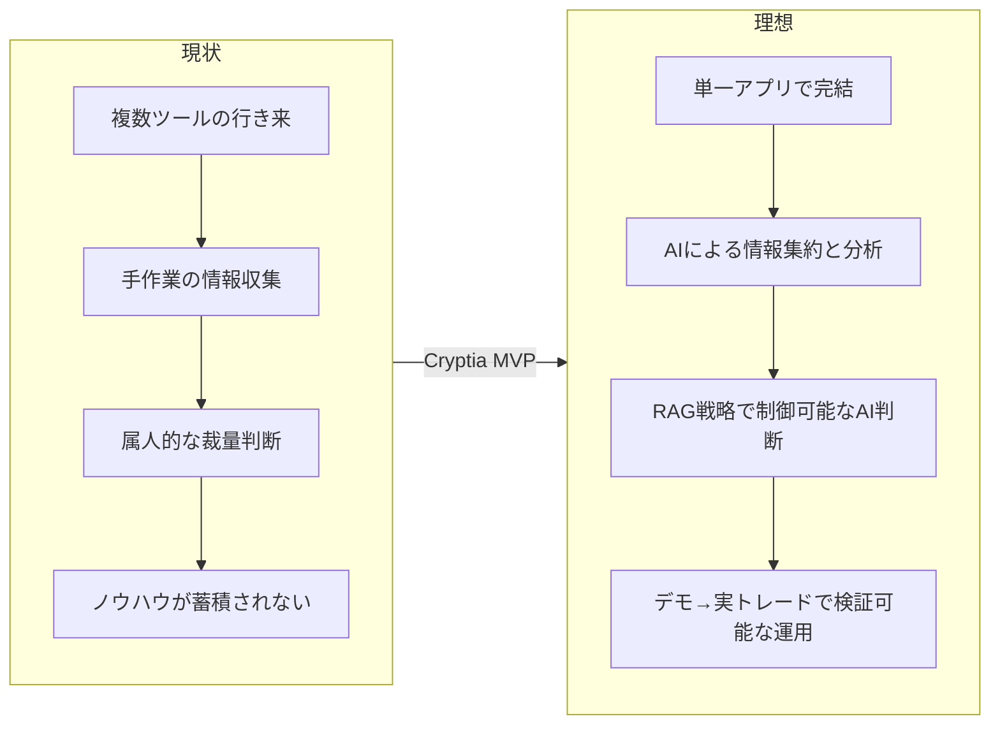

# Phase 0: 現状把握と目標設定

> **セッション形態:** オペレーターから完成された要求仕様が事前提示されたため、壁打ちは圧縮モードで実施。
> 要求仕様の内容を Phase 0 の観点で構造化して記録する。

## 1. 顧客の業界と事業内容

- **業界:** 暗号資産（仮想通貨）・トークン化資産（株式トークン・ゴールドトークン）のトレーディング
- **事業内容:** 個人トレーダー向けのトレード支援アプリ「Cryptia」の提供
- **利用者像:** 仮想通貨・トークン化資産を取引する個人投資家。PC とスマートフォンの両方から利用する

## 2. 現状（今どうやっているか）

- 価格確認・チャート分析・ニュース収集・取引執行を複数のツール（取引所アプリ、チャートツール、ニュースサイト、DEX ツール）を行き来して手作業で行っている
- 資金がどの銘柄からどの銘柄へ動いているか（セクターローテーション）を直感的に把握する手段がない
- トレード判断は個人の裁量に依存し、検証可能な形でノウハウが蓄積されない
- Solana チェーンの新興トークン（いわゆる草コイン・魔界トークン）は情報の非対称性が大きく、選定・利確ルールが属人的

## 3. 理想の姿（最終的にどうなりたいか)

- 1つのアプリで「市況把握 → AI 分析 → デモ検証 → 実トレード」までが完結する
- 資金の流れが空間的・視覚的に把握でき、市場のローテーションを一目で理解できる
- AI が短期・中期・長期の時間軸でトレードアドバイスを提示し、その判断根拠（チャート・ニュース・過去ノウハウ）が追跡できる
- AI トレードの挙動を RAG（戦略ドキュメント）で制御でき、自分の戦術をアプリに教え込める
- スマホでも PC と遜色ない操作感で利用できる（PWA）

## 4. 直近の目標地点（まず何を達成するか）

MVP として以下を達成する:

1. 主要仮想通貨のリアルタイム価格閲覧
2. 資金フローの空間バブルマップ可視化
3. AI インサイト（短期・中期・長期）
4. AI デモトレード（初期資金設定・注文履歴・サマリー）
5. Solana 特化のトークン選定＋ロジック/AI 取引（デモ）
6. ウォレット接続による実トレード（Solana / Jupiter 経由）
7. RAG 戦略設定（デフォルト戦術プリセット付き）
8. PWA 配信・レスポンシブ UI
9. GitHub Actions による Firebase への自動デプロイ

## 現状と理想のギャップ

## ドメインコンテキスト確認

- `.ai-native/domain-context/` 配下（industry / business-flow / persona）は `.gitkeep` のみで資料なし → 読み込み対象なし（確認済み）
