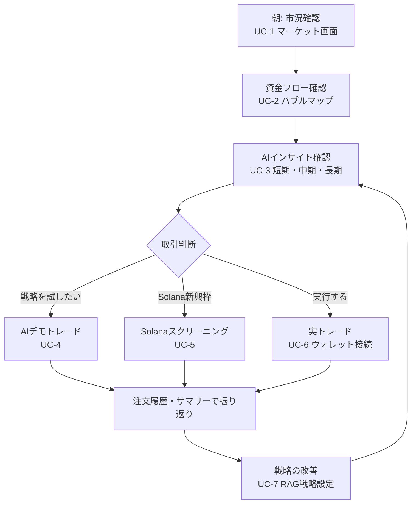

# Phase 2: 業務フロー（トレーダーの1日）

## 各ステップの入出力

| ステップ | 入力 | 出力 |
|---------|------|------|
| 市況確認 | －（自動更新） | 価格・変動率・スパークライン |
| フロー確認 | 期間切替・タップ | バブルマップ・フロー矢印・内訳 |
| インサイト | 銘柄・時間軸 | スタンス・根拠・リスク |
| デモトレード | 資金・銘柄・戦略 | 注文履歴・サマリー |
| Solana | 選定条件・取引手法 | スコア付きリスト・約定ログ |
| 実トレード | 接続・金額・署名 | 見積り・Tx 結果 |
| 戦略改善 | 戦略テキスト・プリセット | AI 挙動への反映 |

## 運用上の制約条件

- 利用環境: PC ブラウザ + スマホ（PWA）。モバイル回線でも実用的な速度
- 利用頻度: 1日複数回・短時間の断続利用（モバイル）＋ 腰を据えた分析（PC）
- 同時利用: 個人利用が主。MVP では 〜1,000 同時接続を想定
- 外部 API 依存: 価格 API・DEX API・AI API の障害時もアプリ自体は劣化動作で継続（グレースフルデグラデーション）
- 実トレードは自己責任。アプリは投資助言を行わない旨を UI に明示
