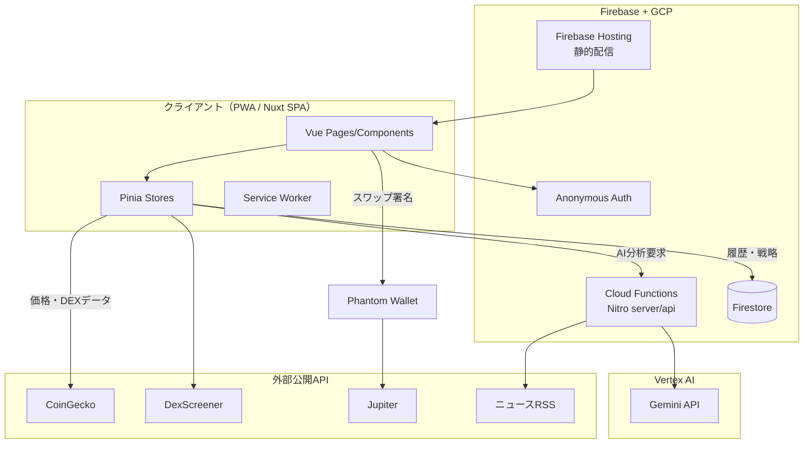

# Phase 4: 技術スタック確定書

> 制約: オペレーター指定により「firebase + GCP + vertexAI」「GitHub Actions デプロイ」「PWA」が前提。

## 確定スタック

| レイヤー | 採用技術 | 選定理由（要件ベース） |
|---------|---------|----------------------|
| フロントエンド | Nuxt 3 + Vue 3 + TypeScript | CLAUDE.md の技術スタック確認ポイント（Nuxt/Vue）と整合。SPA モード（`ssr: false`）で PWA 配信に最適。Nitro サーバーで API を同居でき、Firebase 構成と親和 |
| 状態管理 | Pinia | Nuxt 公式推奨。デモトレード等の複雑な状態を型安全に管理 |
| UI | 自作 CSS（デザイントークン + ユーティリティ） | 依存を最小化し PWA バンドルを軽量に。320px〜のレスポンシブを自前制御 |
| 可視化 | Canvas 2D（自作物理シミュレーション + チャート） | バブルマップは力学配置＋矢印描画のカスタム要件であり汎用チャートライブラリでは表現不可。60fps 要件に対し Canvas が最軽量 |
| PWA | @vite-pwa/nuxt | manifest + Service Worker（オフラインシェル・API キャッシュ戦略）を宣言的に構成 |
| サーバー API | Nitro (Nuxt server/api) → Firebase Cloud Functions | AI キーの秘匿・入力検証・レートリミットをサーバー側で実施。Firebase preset でそのまま Functions にデプロイ可能 |
| AI | Vertex AI Gemini（REST + google-auth-library / ADC） | オペレーター指定。サーバー側から呼び出し、未設定環境ではテクニカル指標フォールバック（BR-5） |
| RAG | 戦略ドキュメントストア（Firestore + ローカル）+ キーワード検索によるコンテキスト注入。将来 Vertex AI Embeddings + Firestore Vector Search へ拡張 | MVP はプロンプト注入型 RAG で十分。methodology のベクトルインデックス方針と将来整合 |
| DB | Firestore（+ クライアント localStorage フォールバック） | uid 単位のドキュメント指向データ（履歴・戦略）に適合。Security Rules で行レベル制御。未設定でもローカルで全機能動作 |
| 市場データ | CoinGecko API（キー不要・CORS 可）+ Binance 公開 API（補助） | リアルタイム価格・時価総額・出来高。無認証で PWA から直接取得可能 |
| Solana データ | DexScreener 公開 API | Solana 新興ペアの流動性・出来高・価格変動を無認証で取得 |
| Solana 取引 | Phantom（window.solana）+ @solana/web3.js + Jupiter API | メインウォレットの秘密鍵は非保持（BR-1 改訂。F-13 ボットウォレットは専用生成鍵を端末内で暗号化保管）。Jupiter は Solana スワップの標準アグリゲーター |
| 認証 | Firebase Anonymous Auth（MVP） | 摩擦なしで uid を確保し Firestore Rules と連動 |
| ホスティング | Firebase Hosting（静的） + Cloud Functions（API） | オペレーター指定。CDN 配信で NFR の初期表示要件を満たす |
| CI/CD | GitHub Actions（既存 deploy.yml パイプライン） | 既存の単体→結合→シナリオ→デプロイのテストゲート構造を再利用（原則3） |
| シークレット | repository secrets / variables + `scripts/setup-cryptia-secrets.ps1`（PowerShell 5.1 互換・UTF-8 BOM） | オペレーター指定（PS5.1 / Shift-JIS 環境 / BOM 付き） |
| テスト | Vitest（unit / integration / scenario） | Nuxt 3 公式推奨。3 段のテストゲートに対応するディレクトリ分割 |

## アーキテクチャ概要

## 非機能要件との整合

- 初期表示 200ms: Hosting CDN + PWA プリキャッシュで達成
- AI 応答 10s: Gemini Flash 系モデル + タイムアウト・フォールバックで担保
- 機密度: AI キー・サービスアカウントはサーバー側のみ。クライアントには一切埋め込まない
- 障害分離: 各外部 API はモジュール別クライアント + フォールバックで疎結合（BR-5）

## 見送った選択肢

| 選択肢 | 見送り理由 |
|--------|-----------|
| Nuxt SSR（ハイブリッド） | PWA + 静的配信で十分。SSR は Functions コールドスタートが初期表示要件に不利 |
| D3.js / Three.js | バンドル増に対し、必要なのは Canvas 物理配置のみ。自作が軽量 |
| WalletConnect 汎用対応 | MVP は Solana 特化のため Phantom（wallet-standard）で十分。将来拡張点として記録 |
| Firestore Vector Search（MVP 導入） | 戦略ドキュメント数が少ない MVP ではキーワード注入で等価の効果。スケール時に導入 |
