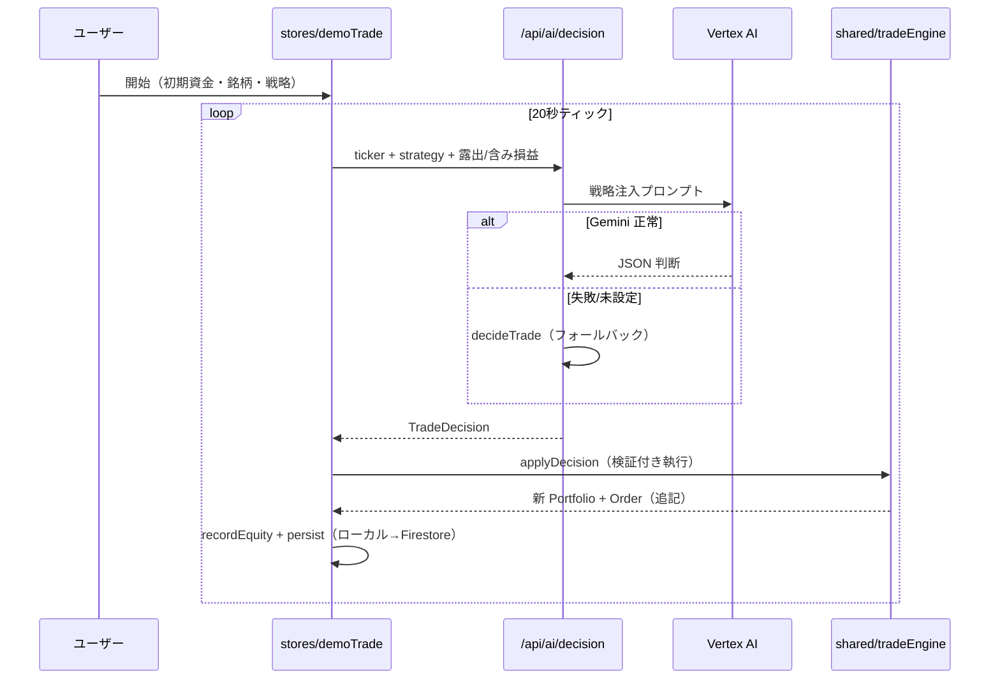

# Phase 5: API 設計

## 自前サーバー API（Nitro → Cloud Functions gen2）

1 API = 1 責務（癒着なし）。全 API はステートレスで、入力は `server/utils/validation.ts` で全件検証する。

### POST /api/ai/insight — AI インサイト生成（F-03）

| 項目 | 内容 |
|------|------|
| 入力 | `{ ticker: Ticker, horizon: 'short'\|'mid'\|'long', strategy?: StrategyDoc, library?: StrategyDoc[]（≦10件・RAG 検索対象） }` |
| ヘッダー | `Authorization: Bearer <Firebase ID トークン>`（任意。認証済みは優遇レート枠 40/分） |
| 検証 | assetId=銘柄マスタ照合 / 数値=有限・範囲 / sparkline≦500点 / strategy≦4000字 / library≦10件 |
| 処理 | 銘柄関連優先のニュース収集（5分キャッシュ）→ ベクトル RAG 検索（Embeddings、失敗時キーワード）→ 戦略注入プロンプト → Gemini（JSON モード・9s タイムアウト）→ 解析失敗時 `fallbackInsight` |
| 出力 | `Insight`（stance/confidence/summary/reasons/risks/**entryRanges（ロング/ショート別エントリーレンジ・現値±50% で検証）**/sources/engine/generatedAt） |
| エラー | 400 `CRYPTIA-E301`（検証）/ 429 `CRYPTIA-E302` / 401 `CRYPTIA-E303`（認証必須環境）。AI 障害は 200 + engine:'fallback'（BR-5） |

> /api/ai/decision・/api/ai/degen-decision も同様に `library` パラメータと Authorization ヘッダーを受け付ける。

### POST /api/ai/decision — デモトレード判断（F-04）

| 項目 | 内容 |
|------|------|
| 入力 | `{ ticker, strategy, exposureRatio: 0-1, unrealizedPct: number\|null }` |
| 処理 | 戦略 + ポートフォリオ文脈 → Gemini → 失敗時 `decideTrade`（決定論ロジック） |
| 出力 | `TradeDecision`（action/sizeRatio≦0.3/reason/confidence） |

### POST /api/ai/degen-decision — Solana 草コイン判断（F-06）

| 項目 | 内容 |
|------|------|
| 入力 | `{ token: SolanaToken, strategy, exposureRatio, unrealizedPct }` |
| 検証 | 文字列長・数値範囲を個別検証（銘柄マスタ外のため） |
| 処理 | スコアリング結果 + 戦略 → Gemini → 失敗時 `decideDegenTrade`。sizeRatio ≦ 0.1 に強制 |
| 出力 | `TradeDecision` |

### GET /api/news — 市場ニュース（F-10）

| 項目 | 内容 |
|------|------|
| 処理 | CoinDesk RSS / Cointelegraph RSS / CoinGecko Trending を並行取得（部分失敗許容・5分キャッシュ） |
| 出力 | `{ items: NewsItem[] }`（最大15件・全失敗時は空配列） |

## 外部 API（クライアント直接）

| API | 用途 | 認証 | 障害時 |
|-----|------|------|--------|
| CoinGecko `/coins/markets` | 価格・時価総額・出来高・スパークライン（15s ポーリング） | 不要 | 最終キャッシュ→モック（警告表示） |
| DexScreener `/latest/dex/search`・`/latest/dex/pairs` | Solana ペアのスクリーニング・保有ペア追跡 | 不要 | モック（警告表示） |
| Jupiter `/v6/quote`・`/v6/swap` | スワップ見積り・未署名 Tx 生成 | 不要 | `CRYPTIA-E504` 通知・注文中断 |
| Solana RPC `getBalance` | ウォレット残高 | 不要 | 表示のみ劣化 |

## データフロー整合性（6視点チェック済み）

- 型の継承関係: `TradeDecision`・`Order`・`Portfolio` は shared/types.ts の単一定義をクライアント・サーバーで共用（矛盾の構造的排除）
- クライアントに集約責務を押し付けない: サマリー計算は `summarize()`（shared）に集約し、画面はそれを表示するのみ
