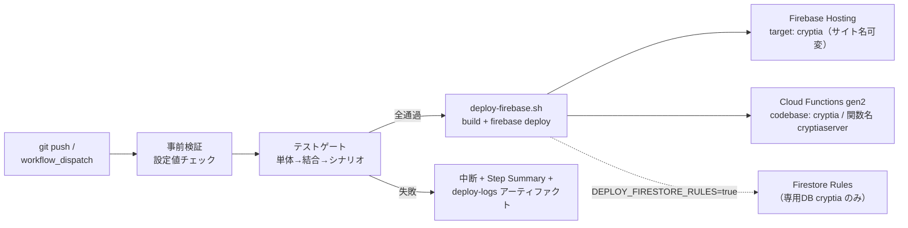

# Phase 5: アーキテクチャ設計

## 全体構成

```mermaid
flowchart TB
    subgraph Client["クライアント（PWA / Nuxt 3 SPA）"]
        Pages["pages/<br/>7画面"] --> Stores["stores/ (Pinia)<br/>market・insights・demoTrade<br/>solana・strategy・wallet・ui"]
        Stores --> Shared["shared/<br/>純ロジック層（同型）"]
        SW["Service Worker<br/>(@vite-pwa)"]
    end
    subgraph Server["Nitro server/api（Firebase Cloud Functions gen2）"]
        API["/api/ai/insight<br/>/api/ai/decision<br/>/api/ai/degen-decision<br/>/api/news"]
        API --> SharedS["shared/（同一コード）"]
        API --> Vertex["utils/vertex.ts<br/>Vertex AI Gemini"]
        API --> News["utils/news.ts<br/>RSS + トレンド収集"]
        API --> Valid["utils/validation.ts<br/>全入力検証"]
    end
    subgraph Ext["外部公開 API"]
        CG["CoinGecko<br/>価格・時価総額"]
        DS["DexScreener<br/>Solana ペア"]
        JUP["Jupiter<br/>スワップ"]
        RSSF["CoinDesk / Cointelegraph RSS"]
    end
    FS[(Firestore<br/>cryptia-users/{uid}/state)]
    Wallet["ウォレット<br/>Phantom / Bitget / Solflare"]

    Stores -->|直接fetch| CG
    Stores --> DS
    Stores -->|"$fetch"| API
    Vertex --> GeminiAPI["Vertex AI"]
    News --> RSSF
    Stores -->|同期キャッシュ| FS
    Pages --> Wallet
    Wallet --> JUP
```

## レイヤー責務

| レイヤー | 責務 | 障害時の振る舞い（BR-5） |
|---------|------|------------------------|
| `shared/` | 型・エラーコード・テクニカル指標・フロー推定・売買判断・取引エンジン・スコアリング（純関数） | — （外部依存なし。全テストの主対象） |
| `stores/` | 状態管理・外部 API フェッチ・永続化・ティック実行 | 価格/DEX/RPC→サーバープロキシへ自動フォールバック→モック/最終キャッシュ、AI→ローカルロジック |
| `server/api` | AI キー秘匿・入力検証・ニュース収集・Gemini 呼び出し | Vertex 失敗→`shared/advisor` フォールバック |
| `composables/` | Firebase 遅延初期化・ローカル/リモート永続化 | Firebase 未設定→ローカルのみで全機能動作 |

## 設計上の重要判断

1. **同型ロジック（isomorphic shared/）:** AI 判断のフォールバックロジックをクライアント・サーバーで共有。
   オフラインでもデモトレードが完全動作し、テストは外部依存なしで全パスを検証できる。
2. **AI 呼び出しはサーバー経由のみ:** Vertex AI の認証情報（ADC）はクライアントに一切露出しない。
   クライアントからの入力は `validation.ts` で全件検証（銘柄マスタ・数値範囲・文字列長）。
3. **秘密鍵非保持（BR-1）:** ウォレット署名は接続中ウォレット（Phantom / Bitget Wallet / Solflare 等）内で完結。アプリは未署名 Tx の生成までしか行わない。
4. **追記型データ（BR-7）:** 注文・取引ログ・アーカイブは追記のみ。エンジンは immutable 更新で
   巻き戻しバグを構造的に防止する。
5. **SoT 宣言（原則6）:** ユーザーデータの SoT はクライアント操作結果（ローカルストレージ）。
   Firestore は同期キャッシュであり、書込は「ローカル→Firestore」の順に限定（data-design.md 参照）。

## デプロイ構成



> **共有プロジェクトでの同居:** Functions は codebase `cryptia`・関数名 `cryptiaserver`、
> Hosting は target `cryptia`（`FIREBASE_HOSTING_SITE` で実サイトへバインド）、
> Firestore は**専用の名前付きデータベース `cryptia`**（+ コレクション `cryptia-` prefix の多層防御）。
> Security Rules はデータベース単位のため、ルールのデプロイも他アプリへ影響しない。

- テストゲート: `UNIT_TEST_CMD` → `INTEGRATION_TEST_CMD` → `SCENARIO_TEST_CMD`（既存パイプラインを再利用: 原則3）
- シークレット: repository secrets（`DEPLOY_TOKEN` = SA JSON / `DEPLOY_TARGET` = プロジェクト ID）
- 監視: Cloud Logging（Functions の構造化ログにエラーコード `CRYPTIA-Exxx` を出力）
