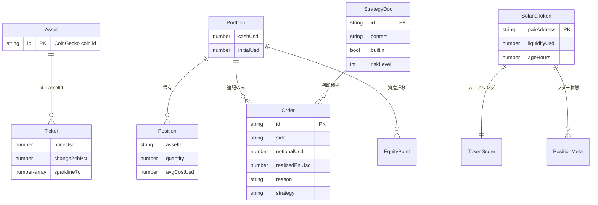

# Phase 5: データ設計

## SoT（Source of Truth）宣言（原則6）

| データ | SoT | キャッシュ/複製 | 同期方向 |
|--------|-----|----------------|---------|
| 市場価格・ティッカー | CoinGecko（外部） | stores/market（メモリ）+ SW キャッシュ | 外部→クライアント（読み取り専用） |
| Solana ペア情報 | DexScreener（外部） | stores/solana（メモリ）+ SW キャッシュ | 外部→クライアント（読み取り専用） |
| デモトレード状態（ポートフォリオ・注文・アーカイブ） | クライアント操作結果（localStorage） | Firestore `cryptia-users/{uid}/state/demo-trade` | ローカル先行 → Firestore 後追い |
| Solana セッション状態 | 同上（localStorage） | Firestore `cryptia-users/{uid}/state/solana-degen` | 同上 |
| 戦略ドキュメント | 同上（localStorage） | Firestore `cryptia-users/{uid}/state/strategies` | 同上 |
| 取引ガード設定・実トレードログ | 同上（localStorage） | Firestore `cryptia-users/{uid}/state/trade-guard` / `live-trade-log` | 同上 |
| 実トレードの真の約定記録 | **Solana チェーン**（オンチェーン） | アプリ内ログは参考記録（Solscan リンクで原本参照） | チェーン→参照のみ |

- 復元時は `savedAt` の新しい方を採用（複数端末同期）。SoT から復元できないデータ:
  Firestore 未設定環境のローカルデータは端末ローカルに限定される（設計判断として文書化）。

## エンティティ定義（shared/types.ts が正）



- PK は意味を持たない ID（Order.id = 時刻+連番の生成 ID、Asset.id は外部 API キーを兼ねる静的マスタ）
- 複合キー不使用。正規化: 注文は銘柄 ID 参照のみを保持し、表示名はマスタから解決

## マスタデータ

| マスタ | 静的/動的 | 管理方法 |
|--------|----------|---------|
| 銘柄マスタ（ASSETS 18銘柄） | 静的 | `shared/assets.ts`（コード管理。追加はコード変更 = レビューゲートを通る） |
| 戦略プリセット（5種） | 静的（builtin・削除不可） | `shared/strategyPresets.ts` |
| ユーザー戦略 | 動的 | 戦略画面で CRUD（builtin は複製で編集）。適用先は画面別（`activeByContext`。旧形式 `activeId` は復元時に全画面へ移行: 原則7） |
| ラダールール | 動的（既定値あり） | `DEFAULT_LADDER_RULES`（ラダー）/ `SNIPE_LADDER_RULES`（新規上場スナイプ: 利益確保型） + セッション設定 |

## Firestore スキーマ

```
cryptia-users/{uid}/state/{stateKey}
  ├── savedAt: number   # クライアント保存時刻（競合解決キー）
  └── json: string      # 状態の JSON シリアライズ（< 256KB, Rules で検証）
```

- **専用の名前付きデータベース `cryptia`** を使用（共有プロジェクトで他アプリとルール・データを完全分離。
  DB ID は `NUXT_PUBLIC_FIREBASE_DATABASE_ID` で変更可）
- コレクション名の `cryptia-` prefix は、誤って既定 DB を参照した場合の衝突回避としての多層防御
- stateKey: `demo-trade` / `solana-degen` / `strategies` / `trade-guard` / `live-trade-log`（Rules でホワイトリスト検証）
- Security Rules: `request.auth.uid == uid` の行レベル制御 + フィールド型・サイズ検証。他パスは全拒否
- 記録系（注文・ログ）は JSON 内で追記のみ。再実行・再訪で巻き戻らない（原則2 / BR-7）

## データ保護・下位互換（原則7）

- スキーマ変更時は `stateKey` を追加する方式とし、既存キーの構造変更は読み込み側の後方互換パースで吸収する
- デモ/Solana の永続化は複数セッション形式（`sessions[]`）。旧形式（単一 `portfolio` 等の
  トップレベルフィールド）は復元時に 1 セッションへ自動移行する（原則7）
- ムーンバッグ手法の追加フィールド（セッションの `moonbagStopLossPct`・positionMeta の
  `moonbagAt` / `mint`）は**加算的**で既存セッションに影響しない（原則7）。復元時は設定値を正規化し、
  moonbag セッションのラダールールは設定から決定的に再構築する（**設定 `moonbagStopLossPct` が
  ルール構成の SoT**。改変・欠落データでも設定と実行ルールが乖離しない）
- **ムーンバッグの恒久増加（設計判断として明記）:** ムーンバッグ保有は全量決済されないため、
  positions / positionMeta / watchedPairs がセッション寿命にわたり増え続ける（1 件あたり
  約 0.3KB。他の増加要素 orders / equityCurve / enteredPairs・Mints / archives は全て上限あり）。
  200KB 予算に対し**数百件規模までは安全**で、想定運用（1 日数件のムーンバッグ化）では到達に
  数か月を要する。超過時は `fitSessionsToBudget` が約定履歴・資産推移の永続化コピーを段階縮小して
  保護し、それでも収まらない極端なケースはローカル保存で継続 + 同期警告（CRYPTIA-E601）となる。
  エントリー履歴（enteredPairs / enteredMints）の 200 件間引きは**保有中（ムーンバッグ含む）の分を
  保護**し、positionMeta.mint の照合と併せて保有中トークンの別プールへの再エントリーを防ぐ
- スキャルプ手法の追加フィールド（`DegenSession.scalp`（ScalpConfig）・`PositionMeta.enteredAt`・
  ボット `BotConfig.scalp*` / `BotPosition.maxHoldMin`）も**加算的**（原則7）。設定が SoT で復元時に
  正規化 + ラダー再構築（moonbag と同方式）。`enteredAt` は時間切れ手仕舞いの判定に使うため
  ボット復元時は数値検証し、不正値のポジションは除外する
- localStorage の破損 JSON は無視して初期状態で継続（クラッシュさせない）
- **ボットウォレット（F-13）は端末ローカル限定:** `bot-wallet-key`（PBKDF2+AES-GCM 暗号化鍵・出金先アドレス）と
  `bot-trade-state`（設定・ポジション・実行ログ）は `saveLocal` のみで保存し、**Firestore へは決して同期しない**
  （鍵と同じ端末に閉じる設計判断。ボットの実行・状態・履歴は端末単位。stateKey ホワイトリストにも追加しない）
- アーカイブは最大 20 件・equityCurve は最大 500 点に間引き（ストレージ保護。間引きは古い中間点のみで、最新値と端点は保持）
- アーカイブの約定履歴（`orders`）は加算的フィールド（旧データは `orders` なしでもサマリー閲覧可: 原則7）。
  容量保護は 2 段構え: (1) 件数上限（明細は直近 10 セッション・各 100 件）に加え、
  (2) 保存時に**シリアライズ後の実測バイト数**（`shared/persistBudget.ts`・予算 200KB）で
  Rules 上限 262144 バイト内に収まることを保証する。超過時は古いアーカイブの明細 → 古いアーカイブ本体の順で
  切り詰める（実行中ポートフォリオの追記記録には手を付けない）。同期失敗時はセッション初回のみ
  ユーザーへ通知する（CRYPTIA-E601。サイレント恒久失敗の防止）
