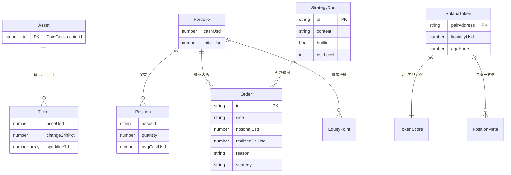

# Phase 5: データ設計

## SoT（Source of Truth）宣言（原則6）

| データ | SoT | キャッシュ/複製 | 同期方向 |
|--------|-----|----------------|---------|
| 市場価格・ティッカー | CoinGecko（外部） | stores/market（メモリ）+ SW キャッシュ | 外部→クライアント（読み取り専用） |
| Solana ペア情報 | DexScreener（外部） | stores/solana（メモリ）+ SW キャッシュ | 外部→クライアント（読み取り専用） |
| デモトレード状態（ポートフォリオ・注文・アーカイブ） | クライアント操作結果（localStorage） | Firestore `users/{uid}/state/demo-trade` | ローカル先行 → Firestore 後追い |
| Solana セッション状態 | 同上（localStorage） | Firestore `users/{uid}/state/solana-degen` | 同上 |
| 戦略ドキュメント | 同上（localStorage） | Firestore `users/{uid}/state/strategies` | 同上 |
| 取引ガード設定・実トレードログ | 同上（localStorage） | Firestore `users/{uid}/state/trade-guard` / `live-trade-log` | 同上 |
| 実トレードの真の約定記録 | **Solana チェーン**（オンチェーン） | アプリ内ログは参考記録（Solscan リンクで原本参照） | チェーン→参照のみ |

- 復元時は `savedAt` の新しい方を採用（複数端末同期）。SoT から復元できないデータ:
  Firestore 未設定環境のローカルデータは端末ローカルに限定される（設計判断として文書化）。

## エンティティ定義（shared/types.ts が正）



- PK は意味を持たない ID（Order.id = 時刻+連番の生成 ID、Asset.id は外部 API キーを兼ねる静的マスタ）
- 複合キー不使用。正規化: 注文は銘柄 ID 参照のみを保持し、表示名はマスタから解決

## マスタデータ

| マスタ | 静的/動的 | 管理方法 |
|--------|----------|---------|
| 銘柄マスタ（ASSETS 18銘柄） | 静的 | `shared/assets.ts`（コード管理。追加はコード変更 = レビューゲートを通る） |
| 戦略プリセット（5種） | 静的（builtin・削除不可） | `shared/strategyPresets.ts` |
| ユーザー戦略 | 動的 | 戦略画面で CRUD（builtin は複製で編集） |
| ラダールール | 動的（既定値あり） | `DEFAULT_LADDER_RULES` + セッション設定 |

## Firestore スキーマ

```
users/{uid}/state/{stateKey}
  ├── savedAt: number   # クライアント保存時刻（競合解決キー）
  └── json: string      # 状態の JSON シリアライズ（< 900KB, Rules で検証）
```

- stateKey: `demo-trade` / `solana-degen` / `strategies` / `trade-guard` / `live-trade-log`
- Security Rules: `request.auth.uid == uid` の行レベル制御 + フィールド型・サイズ検証。他パスは全拒否
- 記録系（注文・ログ）は JSON 内で追記のみ。再実行・再訪で巻き戻らない（原則2 / BR-7）

## データ保護・下位互換（原則7）

- スキーマ変更時は `stateKey` を追加する方式とし、既存キーの構造変更は読み込み側の後方互換パースで吸収する
- localStorage の破損 JSON は無視して初期状態で継続（クラッシュさせない）
- アーカイブは最大 20 件・equityCurve は最大 500 点に間引き（ストレージ保護。間引きは古い中間点のみで、最新値と端点は保持）
