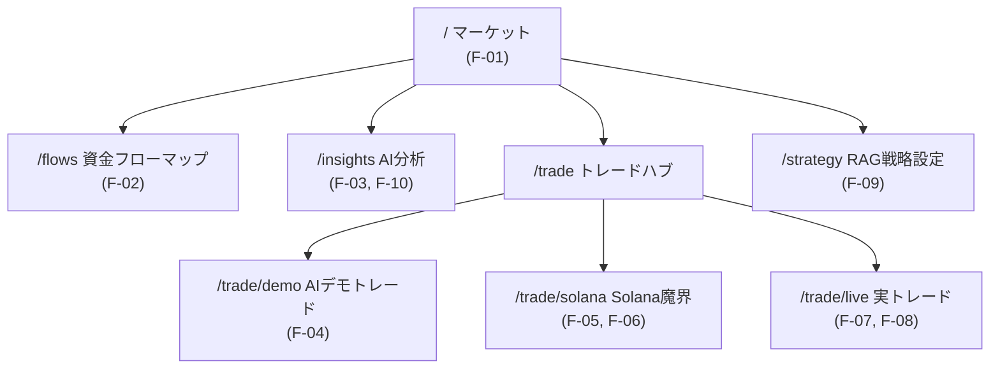

# Phase 5: 画面設計

## サイトマップ

## ナビゲーション（原則8: レスポンシブ）

| デバイス | ナビ形式 | 項目 |
|---------|---------|------|
| モバイル（〜767px） | 下部固定タブ（5項目・タップターゲット 40px+・safe-area 対応） | マーケット / フロー / AI分析 / トレード（ハブ） / 戦略 |
| PC（768px〜） | 左サイドナビ（全8項目直接遷移） | 上記 + デモ/Solana/実トレードへの直接リンク |

## 画面別定義

| 画面 | 主要素 | モバイル対応 |
|------|--------|-------------|
| マーケット `/` | 資産クラスタブ、価格カードグリッド、選択銘柄詳細（統計6項目+チャート）、更新時刻、モック警告 | カード 1-2 列に自動折返し。統計は 3 列グリッド |
| フロー `/flows` | 期間タブ（1h/24h/7d）、バブルマップ Canvas、選択銘柄の流入出内訳パネル | Canvas 高さを画面の 62% に自動調整。タップで選択 |
| AI分析 `/insights` | 銘柄セレクト、時間軸タブ（短期/中期/長期）、インサイトカード（スタンス・確信度バー・根拠・リスク・ソース・エンジン表示）、再生成、ニュース一覧 | 全要素縦積み。select は 16px フォント（iOS ズーム防止） |
| トレードハブ `/trade` | 3機能へのカードリンク（リスクバッジ付き） | — |
| デモトレード `/trade/demo` | 設定フォーム（初期資金・エンジン・戦略ピッカー・銘柄チップ・AIおすすめ）、統計6項目 + 価格更新の鮮度表示、資産推移チャート、ポジション、注文履歴、過去セッション（タップで約定履歴を展開） | 注文履歴は PC=テーブル / モバイル=カードに切替（原則8） |
| Solana `/trade/solana` | 免責、セッション設定（割当資金・手法タブ: ラダー/新規上場ハンター/自動スナイプ(常時監視)/AI・自動スナイプ設定(最大同時数・監査基準)・戦略ピッカー）、新規上場リスト（シグナルチップ付きカード）、実行ダッシュボード（価格更新の鮮度表示）、スコア付きトークンカード、過去セッション（タップで約定履歴を展開）、接続障害バナー + 再試行 | トークンカードは 1 列に折返し |
| 実トレード `/trade/live` | 常設免責、ウォレット接続（検出ウォレットの選択ボタン: Phantom/Bitget/Solflare 等・残高エラーの明示表示）、取引ガード（同意+上限）、注文パネル（戦略ピッカー・AIおすすめ/主要トークンチップ・見積り・AI判断）、確認モーダル、取引履歴（Solscan リンク） | モーダルは 94vw。数値入力は inputmode 指定 |
| 戦略 `/strategy` | 画面別の適用戦略（4 画面分のピッカー）、戦略カード一覧（プリセット/カスタム・リスクバッジ・適用中画面チップ・「すべての画面に適用」）、作成/編集フォーム（名前・ルール・リスクスライダー） | 2 列 → 1 列に折返し |

## 状態表示の原則

- ローディング: スケルトン表示（layout shift 防止）
- 外部 API 障害: 画面上部に警告バナー + 機能単位の劣化（BR-5）
- デモ/実トレードの区別: 実トレードは常設免責 + 「実資金」バッジ + 確認モーダル（BR-3）
- 通知: 画面上部トースト（エラーコード付き、5秒自動消滅、aria-live）

## ユーザビリティチェック（U-1〜U-4 抜粋）

- U-1 入力負荷: 銘柄選択はチップのトグル式。AI おすすめの一括適用ボタンあり
- U-2 出力直感性: 損益は色（緑/赤）+ 符号付き%で統一。確信度はバー表示
- U-3 誤操作防止: 実トレードは 2 段階（見積り→署名確認）。デモ開始は資金・銘柄のバリデーション付き
- U-5 アクセシビリティ: role/aria-selected/aria-live 付与。Canvas に aria-label
